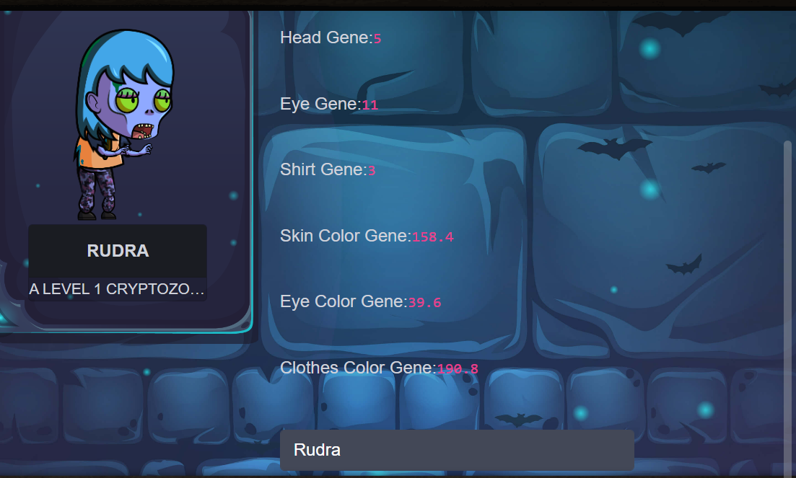
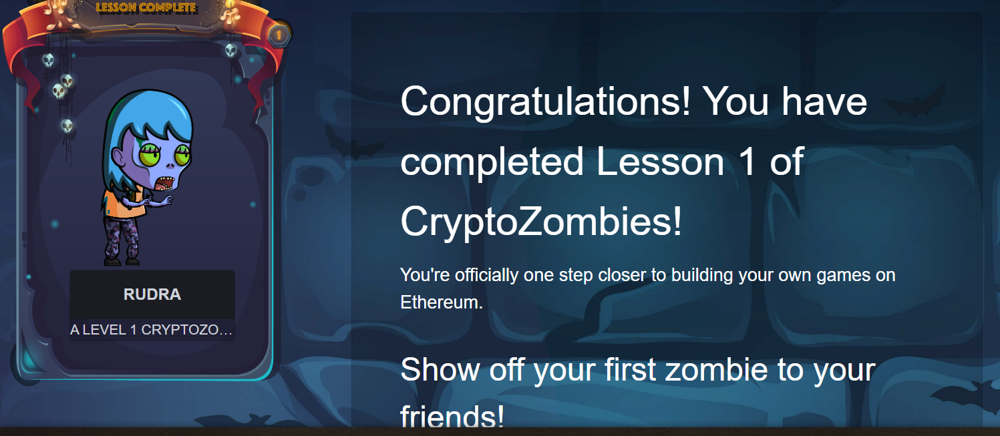

# Chapter 14: Web3.js

Our Solidity contract is complete! Now we need to write a JavaScript frontend that interacts with the contract.

Ethereum has a JavaScript library called Web3.js.

In a later lesson, we'll go over in depth how to deploy a contract and set up Web3.js. But for now let's just look at some sample code for how Web3.js would interact with our deployed contract.

## Setting Up Web3.js and Contract Interaction

1. **Web3 Setup**: Include Web3.js library in your project and connect to an Ethereum provider (like MetaMask, Ganache, or Infura).

   ```html
   <!-- Include Web3.js library -->
   <script src="https://cdn.jsdelivr.net/npm/web3@1.6.0/dist/web3.min.js"></script>
   ```

   ```javascript
   // Connect to Ethereum provider (e.g., MetaMask injected provider)
   if (typeof window.ethereum !== 'undefined') {
     window.web3 = new Web3(window.ethereum);
     // Request account access if needed
     window.ethereum.enable();
   } else {
     console.log('Non-Ethereum browser detected. You should consider installing MetaMask.');
   }
   ```

2. **Contract ABI and Address**: Define your contract's ABI (Application Binary Interface) and address after deploying it on the Ethereum blockchain.

   ```javascript
   // Replace with your actual ABI and contract address after deployment
   var abi = /* ABI generated by the compiler */;
   var contractAddress = /* Your contract address on Ethereum */;
   var ZombieFactoryContract = new web3.eth.Contract(abi, contractAddress);
   ```

3. **Interact with Contract Methods**: Use Web3.js to call your contract's functions.

   ```javascript
   // Example function to call the createRandomZombie method
   $("#ourButton").click(function(e) {
     var name = $("#nameInput").val();
     // Call createRandomZombie function on button click
     ZombieFactoryContract.methods.createRandomZombie(name).send({ from: /* sender address */, gas: /* gas limit */ })
       .on('transactionHash', function(hash){
         console.log("Transaction Hash:", hash);
       })
       .on('receipt', function(receipt){
         console.log("Transaction Receipt:", receipt);
         // Optionally update UI or take further action
       })
       .on('error', console.error); // Handle error
   });
   ```

4. **Event Listening**: Listen for events emitted by your contract to update the frontend UI.

   ```javascript
   // Listen for the NewZombie event and update UI with new zombie details
   var event = ZombieFactoryContract.events.NewZombie(function(error, event) {
     if (!error) {
       const { zombieId, name, dna } = event.returnValues;
       const zombieDetails = generateZombie(zombieId, name, dna);
       // Update UI or perform other actions with zombieDetails
     } else {
       console.error("Error with event:", error);
     }
   });
   ```

5. **Generating Zombie Details**: Define a function to parse DNA and update UI elements based on the generated zombie details.

   ```javascript
   function generateZombie(id, name, dna) {
     let dnaStr = String(dna);
     while (dnaStr.length < 16)
       dnaStr = "0" + dnaStr;

     const zombieDetails = {
       headChoice: parseInt(dnaStr.substring(0, 2), 16) % 7 + 1,
       eyeChoice: parseInt(dnaStr.substring(2, 4), 16) % 11 + 1,
       shirtChoice: parseInt(dnaStr.substring(4, 6), 16) % 6 + 1,
       skinColorChoice: parseInt(dnaStr.substring(6, 8), 16) / 256 * 360,
       eyeColorChoice: parseInt(dnaStr.substring(8, 10), 16) / 256 * 360,
       clothesColorChoice: parseInt(dnaStr.substring(10, 12), 16) / 256 * 360,
       zombieName: name,
       zombieDescription: "A Level 1 CryptoZombie"
     };
     return zombieDetails;
   }
   ```

### Putting It All Together

Combine these elements into your HTML and JavaScript files to create a fully functional frontend that interacts with your Ethereum smart contract. Make sure to handle error cases, adjust gas limits, and manage user interactions as per your application requirements.

This setup will allow your users to create zombies by calling the `createRandomZombie` function and see their generated zombies on the frontend using the `NewZombie` event. Adjust the UI update logic (like image swaps and CSS filters) based on your frontend framework (e.g., Vue.js).

Feel free to replace placeholder comments (`/* ABI generated by the compiler */`, `/* Your contract address on Ethereum */`, etc.) with your actual contract details and frontend logic to create an engaging blockchain application!


It should guide you through setting up your JavaScript frontend to interact with your Solidity contract using Web3.js. Adjust the placeholders (`abi`, `contractAddress`, etc.) with your actual contract details and frontend setup as needed.



After Completing this level go to the ```next``` page

Now you have completed ```Lesson1```


