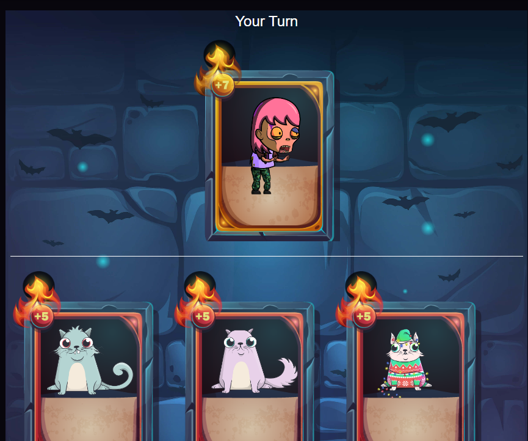

# Chapter 14: Wrapping It Up

That's it, you've completed lesson 2!

You can check out the demo to the right to see it in action. Go ahead, I know you can't wait until the bottom of this page 😉. Click a kitty to attack, and see the new kitty zombie you get!

## JavaScript Implementation

Once we're ready to deploy this contract to Ethereum we'll just compile and deploy `ZombieFeeding` — since this contract is our final contract that inherits from `ZombieFactory`, and has access to all the public methods in both contracts.

Let's look at an example of interacting with our deployed contract using JavaScript and web3.js:

```javascript
var abi = /* abi generated by the compiler */
var ZombieFeedingContract = web3.eth.contract(abi)
var contractAddress = /* our contract address on Ethereum after deploying */
var ZombieFeeding = ZombieFeedingContract.at(contractAddress)

// Assuming we have our zombie's ID and the kitty ID we want to attack
let zombieId = 1;
let kittyId = 1;

// To get the CryptoKitty's image, we need to query their web API. This
// information isn't stored on the blockchain, just their webserver.
// If everything was stored on a blockchain, we wouldn't have to worry
// about the server going down, them changing their API, or the company
// blocking us from loading their assets if they don't like our zombie game ;)
let apiUrl = "https://api.cryptokitties.co/kitties/" + kittyId
$.get(apiUrl, function(data) {
  let imgUrl = data.image_url
  // do something to display the image
})

// When the user clicks on a kitty:
$(".kittyImage").click(function(e) {
  // Call our contract's `feedOnKitty` method
  ZombieFeeding.feedOnKitty(zombieId, kittyId)
})

// Listen for a NewZombie event from our contract so we can display it:
ZombieFactory.NewZombie(function(error, result) {
  if (error) return
  // This function will display the zombie, like in lesson 1:
  generateZombie(result.zombieId, result.name, result.dna)
})
```

## Result




## Give it a try!

Select the kitty you want to feed on. Your zombie's DNA and the kitty's DNA will combine, and you'll get a new zombie in your army!

Notice those cute cat legs on your new zombie? That's our final 99 digits of DNA at work 😉

You can start over and try again if you want. When you get a kitty zombie you're happy with (you only get to keep one), go ahead and proceed to the next chapter to complete lesson 2!