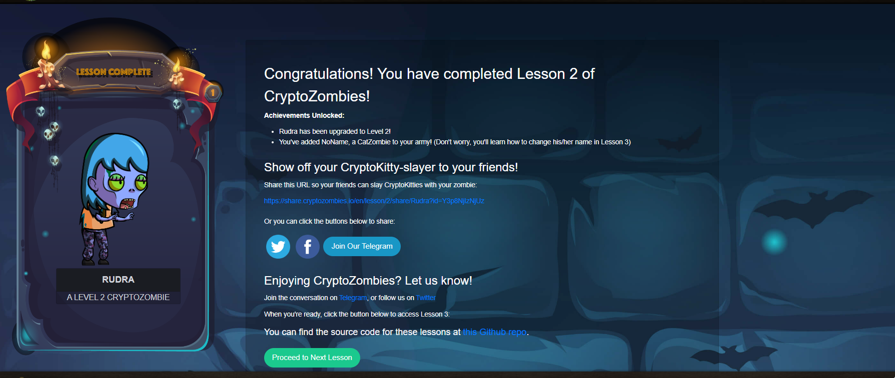

# Congratulations! You have completed Lesson 2 of CryptoZombies!

## Achievements Unlocked:

- **Rudra has been upgraded to Level 2!**
- **You've added NoName, a CatZombie to your army!** (Don't worry, you'll learn how to change his/her name in Lesson 3)

## Show off your CryptoKitty-slayer to your friends!

Share this URL so your friends can slay CryptoKitties with your zombie:

[https://share.cryptozombies.io/en/lesson/2/share/Rudra?id=Y3p8NjIzNjUz](https://share.cryptozombies.io/en/lesson/2/share/Rudra?id=Y3p8NjIzNjUz)

Or you can click the buttons below to share:

[Twitter](#) [Facebook](#)

## Enjoying CryptoZombies? Let us know!

Join the conversation on [Telegram](#), or follow us on [Twitter](#)

When you're ready, click the button below to access Lesson 3:

You can find the source code for these lessons at this [Github repo](#).

## Result

