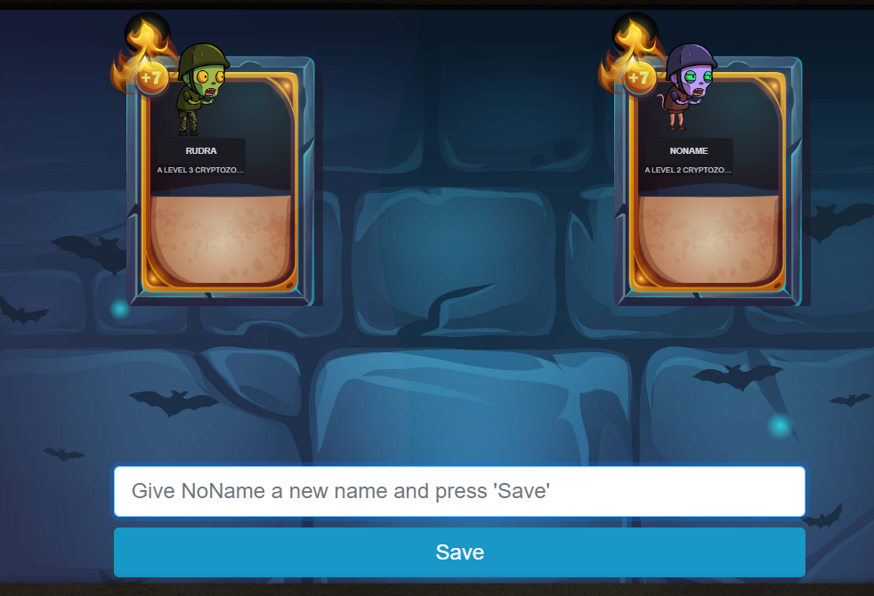
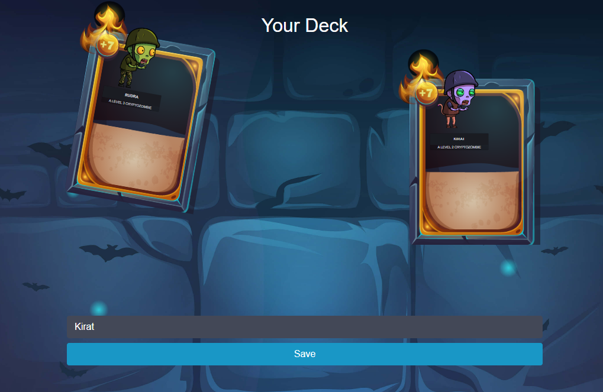

# Chapter 13: Wrapping It Up

Congratulations! That concludes Lesson 3.

## Let's Recap:

- We've added a way to update our CryptoKitties contracts.
- We've learned to protect core functions with `onlyOwner`.
- We've learned about gas and gas optimization.
- We added levels and cooldowns to our zombies.
- We now have functions to update a zombie's name and DNA once the zombie gets above a certain level.
- And finally, we now have a function to return a user's zombie army.

## Claim Your Reward

As a reward for completing Lesson 3, both of your zombies have leveled up!

And now that NoName (the kitty-zombie you created in Lesson 2) is upgraded to level 2, you can call `changeName` to give him/her a name. NoName no more!

Go ahead and give NoName a name, then proceed to the next chapter to complete the lesson.

```solidity
// SPDX-License-Identifier: MIT
pragma solidity ^0.8.0;

import "./zombiehelper.sol";

contract ZombieHelper is ZombieFeeding {

    // External view function to get all zombies owned by a specific address
    function getZombiesByOwner(address _owner) external view returns (uint[] memory) {
        // Get the number of zombies owned by _owner
        uint zombieCount = ownerZombieCount[_owner];

        // Declare a new array in memory with the length of zombieCount
        uint[] memory result = new uint[](zombieCount);

        // Declare a counter for indexing the result array
        uint counter = 0;

        // Iterate through all zombies
        for (uint i = 0; i < zombies.length; i++) {
            // Check if the zombie belongs to _owner
            if (zombieToOwner[i] == _owner) {
                // Add zombie ID to the result array
                result[counter] = i;
                // Increment counter
                counter++;
            }
        }

        // Return the array of zombies owned by _owner
        return result;
    }

    // Other functions and code for ZombieHelper contract can go here

}
```

## Images

1. Give a name to the zombie




2. Now see the result

 

# Sample Hardhat Project

This project demonstrates a basic Hardhat use case. It comes with a sample contract, a test for that contract, and a Hardhat Ignition module that deploys that contract.

Try running some of the following tasks:

```shell
npx hardhat help
npx hardhat test
REPORT_GAS=true npx hardhat test
npx hardhat node
npx hardhat ignition deploy ./ignition/modules/Lock.ts
```
