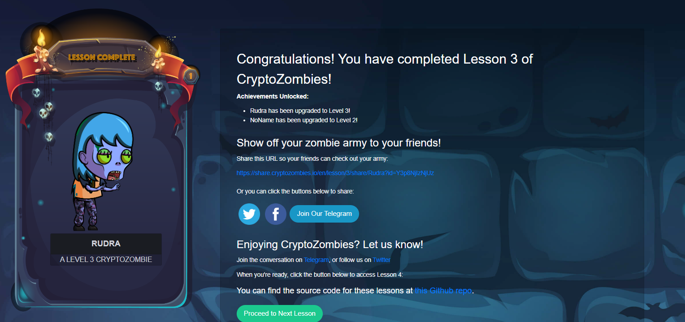

# Congratulations! 🎉

You have completed Lesson 3 of CryptoZombies!

## Achievements Unlocked:

- **Rudra** has been upgraded to Level 3!
- **NoName** has been upgraded to Level 2!

Show off your zombie army to your friends! Share this URL so your friends can check out your army:

[https://share.cryptozombies.io/en/lesson/3/share/Rudra?id=Y3p8NjIzNjUz](https://share.cryptozombies.io/en/lesson/3/share/Rudra?id=Y3p8NjIzNjUz)

Or you can click the buttons below to share:

[Twitter](https://twitter.com/intent/tweet?text=Check%20out%20my%20zombie%20army%20in%20CryptoZombies%21%20https%3A%2F%2Fshare.cryptozombies.io%2Fen%2Flesson%2F3%2Fshare%2FRudra%3Fid%3DY3p8NjIzNjUz) 
[Facebook](https://www.facebook.com/sharer/sharer.php?u=https%3A%2F%2Fshare.cryptozombies.io%2Fen%2Flesson%2F3%2Fshare%2FRudra%3Fid%3DY3p8NjIzNjUz)

Enjoying CryptoZombies? Let us know!

Join the conversation on [Telegram](https://t.me/cryptozombies) or follow us on [Twitter](https://twitter.com/cryptozombies).

When you're ready, click the button below to access Lesson 4:

[Access Lesson 4](https://cryptozombies.io/en/lesson/4)

You can find the source code for these lessons at this [Github repo](https://github.com/cryptozombies/cryptozombies-lesson3).





# Sample Hardhat Project

This project demonstrates a basic Hardhat use case. It comes with a sample contract, a test for that contract, and a Hardhat Ignition module that deploys that contract.

Try running some of the following tasks:

```shell
npx hardhat help
npx hardhat test
REPORT_GAS=true npx hardhat test
npx hardhat node
npx hardhat ignition deploy ./ignition/modules/Lock.ts
```
